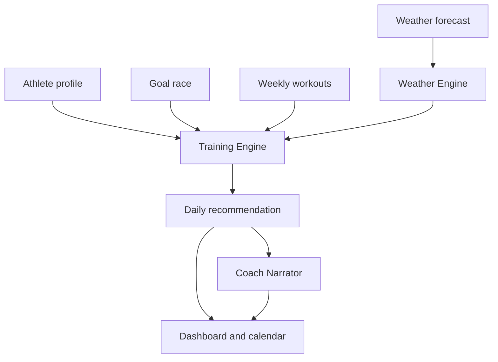

# Adaptive Coach MVP Design

## Product Goal

Build a mobile-friendly website and installable PWA for an adaptive endurance training coach. The MVP focuses on runners using Garmin-like recovery data, goal race timing, weekly availability, weather conditions, and recent training load to recommend the best workout for today.

## Product Principles

- The Training Engine decides workouts with deterministic rules.
- AI-style copy explains decisions, but does not invent or override workouts.
- Every adjustment must show a clear reason.
- The athlete can see the week, understand changes, and manually inspect the rationale.
- The first release must work without paid third-party API credentials.

## MVP Scope

The first MVP includes:

- Responsive web app with PWA metadata.
- Home dashboard with Today's Mission, readiness, weather, race countdown, and coach explanation.
- Dynamic weekly plan with rescheduled workouts and change reasons.
- Progress view with training load, mileage, sleep, HRV, and VO2 max trends from seeded data.
- Goal and availability setup screen using local state.
- Rule-based training engine for running workouts.
- Weather suitability scoring.
- Coach explanation generator that produces bounded natural-language summaries from engine output.

The first MVP does not include live Garmin OAuth, live weather API calls, paid LLM calls, push notifications, native app store packaging, or persistent cloud accounts. Those are Phase 2 features once the core loop feels right.

## Architecture

Use a Vite + React + TypeScript PWA. The app is entirely client-side for the first MVP, using focused domain modules under `src/domain` and presentational screens under `src/components`. This keeps the product easy to run, test, demo, and later migrate behind an API.

The core boundary is:

- `trainingEngine`: deterministic workout recommendation and rescheduling logic.
- `weatherEngine`: suitability scoring and weather risk labels.
- `coachNarrator`: explanation text generated from structured decisions.
- `seedData`: realistic athlete, race, weather, availability, and workout fixtures.
- React components: render the app, never decide coaching behavior directly.

## Data Flow

Seeded athlete data flows into the training engine. The weather engine scores each day, the training engine chooses or adjusts workouts, and the narrator turns the decision into short coach copy. React screens consume a generated weekly plan and render mobile-first UI.

## UI Design

The app opens directly into the working dashboard, not a marketing page. The visual style should feel like a quiet coaching cockpit: readable, structured, energetic, and useful on a phone while still looking polished on desktop.

Primary navigation uses bottom tabs on mobile and a compact rail/header layout on larger screens. The main screens are:

- Home: Today's Mission, readiness, weather, race countdown, coach note, reason chips.
- Plan: seven-day adaptive calendar with workout cards and adjustment labels.
- Progress: metric cards and compact trend visuals.
- Setup: goal race, weekly availability, and simulated Garmin/weather state.

## Training Rules For MVP

- If recovery is poor and sleep is under 6 hours, replace high-intensity workouts with Zone 2 or rest.
- If temperature is at least 32C, move hard workouts to the cooler time window when available.
- If thunderstorms overlap the planned workout window, swap the workout with the next suitable lower-risk day.
- If race day is within 14 days, reduce workout intensity and protect recovery.
- If the athlete has three hard workouts in the last five days, force an easier session.
- Long runs prefer the best weekend weather window.

## Testing Strategy

Domain logic gets unit tests first. UI smoke tests verify that key screens render engine output without crashing. Build verification must pass before each implementation slice is committed.

## Release Definition

The MVP is complete when a user can open the app on desktop or phone, see an adaptive training recommendation for today, understand why the workout moved or changed, inspect the weekly plan, view progress metrics, change simple setup values, and install the site as a PWA.
